<!-- 回到顶部链接兼容性优化，请查看：https://github.com/othneildrew/Best-README-Template/pull/73 -->
<a name="readme-top"></a>
<!--
*** 感谢您查看这个最佳README模板。如果您有任何建议
*** 能够使它变得更好，请Fork该仓库并创建一个Pull Request
*** 或者直接提一个带有 "enhancement" 标签的Issue。
*** 不要忘了给项目加星哦！
*** 再次感谢您！现在去创造一些令人惊叹的东西吧！:D
-->


<!-- PROJECT SHIELDS -->
<!--
*** I'm using markdown "reference style" links for readability.
*** Reference links are enclosed in brackets [ ] instead of parentheses ( ).
*** See the bottom of this document for the declaration of the reference variables
*** for contributors-url, forks-url, etc. This is an optional, concise syntax you may use.
*** https://www.markdownguide.org/basic-syntax/#reference-style-links
-->
[![Contributors][contributors-shield]][contributors-url]
[![Forks][forks-shield]][forks-url]
[![Stargazers][stars-shield]][stars-url]
[![Issues][issues-shield]][issues-url]
[![MIT License][license-shield]][license-url]
<!-- [![LinkedIn][linkedin-shield]][linkedin-url] -->


<!-- 项目LOGO -->
<br />
<div align="center">
  <a href="https://github.com/worst001/nvim_0">
    
  </a>

  <h3 align="center">完整 nvim 配置指南</h3>

  <p align="center">
    自用 nvim 配置，涵盖所有主流插件和功能
    <br />
    <a href="https://github.com/worst001/nvim_0"><strong>探索文档 »</strong></a>
    <br />
  </p>
</div>


<!-- 目录 -->
<details>
  <summary>目录</summary>
  <ol>
    <li>
      <a href="#关于项目">关于项目</a>
      <ul>
        <li><a href="#构建于">构建于</a></li>
      </ul>
    </li>
    <li>
      <a href="#开始使用">开始使用</a>
      <ul>
        <li><a href="#前提条件">前提条件</a></li>
        <li><a href="#安装">安装</a></li>
      </ul>
    </li>
    <li><a href="#用法">用法</a></li>
    <li><a href="#路线图">路线图</a></li>
    <li><a href="#龚贤">贡献</a></li>
    <li><a href="#许可证">许可证</a></li>
    <li><a href="#联系方式">联系方式</a></li>
    <li><a href="#鸣谢">鸣谢</a></li>
  </ol>
</details>


<!-- 关于项目 -->
## 关于项目

![产品名称屏幕截图][Startify-pic]

主要使用 [coc.nvim](https://github.com/neoclide/coc.nvim) 实现代码补全，配置了 `NeoVim` 所需要基本功能，为了层次清晰定义了`6个模块`。

插件涵盖`所有主流编辑功能`，部署完后只要环境允许`可以开发任何语言`，供学习用当然开发也是没有问题的

`这个是几年前的配置方案，仅供参考`，现在有很多新的插件，`Neovim` 不断的在迭代，`不可能停滞不前`。


#### 初始化的时候分了6个模块在init分别为
+ `init-packages.vim`: Plug插件包配置
+ `init-ui.vim`: 界面与主题相关配置
+ `init-packer.vim`: Lua插件包配置
+ `init-better-defaults.vim`: 自定义基础配置
+ `init-keybindings.vim`: 按键绑定配置
+ `init-assist.vim`: 辅助功能配置

#### 插件包分为Plug包_自定义包_Lua包
+ plug包在`init-packages.vim`设置后默认生成在`plugged`目录
+ lua插件包相关配置解耦在`lua/plugin-config`
+ 自定义插件可以写在`plugin`目录
+ `shell`目录为自定义脚本，然后让自定义插件去调就可以了

#### 基本配置与按键

+ 基本配置`init-better-defaults.vim`里主要配置Plug插件所必需的选项
    + 如果该插件有一些按键配置没有解耦的很好也会放这里，不过不多
    + indent配置都在这里，如果有需要你也可以使用插件中的
+ 按键配置都放在 `init-keybindings.vim` 不需要就注释掉
    + 主要还是个人习惯 不爽就改成你的

<p align="right">(<a href="#readme-top">回到顶部</a>)</p>


### 构建于

1. 编辑器
* [![Neovim][Neovim-pic]][Neovim-url]

2. 语言与运行时
* [![node][node-pic]][node-url]
* [![ruby][ruby-pic]][ruby-url]
* [![python][python-pic]][python-url]
* [![clang][clang-pic]][clang-url]
* [![golang][golang-pic]][golang-url]
* [![java][java-pic]][java-url]
* [![lua][lua-pic]][lua-url]

3. 工具
* [![fzf][fzf-pic]][fzf-url]
* [![ag][ag-pic]][ag-url]
* [![rg][rg-pic]][rg-url]

4. 图标字体
* [![DroidSansMono Nerd Font][Font-pic]][Font-url]


<p align="right">(<a href="#readme-top">回到顶部</a>)</p>


<!-- 开始使用 -->
## 开始使用

这是一个如何在本地安装和使用 `Nvim_0` 的指南。
要在本地运行起来，请按照这些简单的示例步骤操作。

以下是 `Nvim_0` 的目录结构:
```
.
├── autoload
│   ├── plug.vim
│   └── plug.vim.old
├── coc-settings.json
├── init
│   ├── config
│   │   └── db.vim
│   ├── init-assist.vim
│   ├── init-better-defaults.vim
│   ├── init-keybindings.vim
│   ├── init-packages.vim
│   ├── init-packer.vim
│   └── init-ui.vim
├── init.vim
├── lua
│   ├── plugin-config
│   └── plugins.lua
├── pack
├── package-lock.json
├── plugged
├── plugin
├── sessions
│   └── default.vim
├── shell
└── syntax
    └── help_cn.vim
```


### 前提条件

1. 先安装 [Neovim](https://github.com/neovim/neovim/releases)
+ 安装完后以 `Linux`/`Mac` 为例其配置目录默认为 `~/.config/nvim`
+ `Windows` 用户请参考 `Neovim` 官方文档

2. `Neovim` 相关的 `client`
```bash
npm install -g neovim

pip install pynvim

gem install neovim
```


### 安装

现在可以开始安装了
+ 根据官方文档，`Neovim` 配置路径位于 `~/.config` 下(`Windows` 环境请查阅相关文档)
+ 事实上这就是个 `Neovim` 配置而已, 所以安装起来非常容易

1. 找到配置目录克隆仓库
   ```sh
   cd ~/.config

   git clone git@github.com:worst001/nvim_0.git nvim
   ```

2. 设置客户端和插件包镜像

   ```sh
   # 用原生`Vim`打开主配置文件
   /usr/bin/vim ~/.config/nvim/init.vim
   ```

   ```vim
   " 设置客户端语言与Client
   :let g:python_host_prog  = '/usr/local/bin/python2'
   :let g:python3_host_prog = '/opt/homebrew/opt/python@3.10/bin/python3.10'
   :let g:ruby_host_prog    = '/opt/homebrew/lib/ruby/gems/3.1.0/bin/neovim-ruby-host'


   " 插件镜像地址修改(Github连不上 可以找国内Github镜像)
   :let g:plug_url_format   = 'https://git::@github.com.cnpmjs.org/%s.git'
   ```

3. 安装包管理插件
   ```sh
    # 安装 vim plug
    sh -c 'curl -fLo "${XDG_DATA_HOME:-$HOME/.local/share}"/nvim/site/autoload/plug.vim --create-dirs \
           https://raw.githubusercontent.com/junegunn/vim-plug/master/plug.vim'

    # 安装 packer
    git clone --depth 1 https://github.com/wbthomason/packer.nvim ~/.local/share/nvim/site/pack/packer/start/packer.nvim
   ```

4. 检查环境安装插件
   ```vim
   # 第一次进入因为没有插件会报错不用管

   # 检查环境 保证各类语言的客户端能够对接到 Neovim
   :checkhealth

   # 安装 Plug 插件
   :PlugInstall

   # 安装 Packer 插件
   :PackerSync

   ```

<p align="right">(<a href="#readme-top">回到顶部</a>)</p>


<!-- 用法 -->
## 用法

<!-- TOC -->
* [环境设置](#环境设置)
* [基础按键](#基础按键)
* [窗口按键](#窗口按键)
* [标签按键](#标签按键)
* [快速进入区域内部](#快速进入区域内部)
* [内部终端](#内部终端)
* [界面展示设置](#界面展示设置)
* [索引与查询](#索引与查询)
    - [grep](#grep)
    - [file_buffer](#file_buffer)
    - [command](#command)
    - [history](#history)
* [功能窗口](#功能窗口)
* [编辑模式](#编辑模式)
* [一些好用的插件](#一些好用的插件)
* [自定义功能](#自定义功能)
* [主题与外观](#主题与外观)
* [Packer插件](#Packer插件)
* [自定义插件与调试](#自定义插件与调试)
 <!-- /TOC -->

### 环境设置

| 快捷键          | 行为                 |
|-----------------|----------------------|
| `F2`            | 进入主配置文件       |
| `SPACE` `F1`    | 查看命令历史         |
| `SPACE` `F2`    | Plug插件设置         |
| `SPACE` `F3`    | Packer插件添加       |
| `SPACE` `F4`    | Packer插件自定义设置 |
| `SPACE` `s` `x` | 配置文件立即生效     |

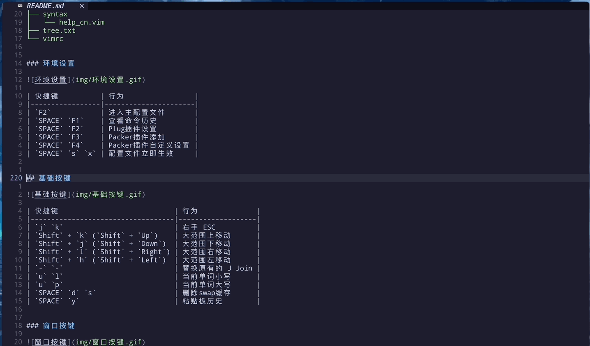


### 基础按键

| 快捷键                            | 行为              |
|-----------------------------------|-------------------|
| `j` `k`                           | 右手 ESC          |
| `Shift` + `k` (`Shift` + `Up`)    | 大范围上移动      |
| `Shift` + `j` (`Shift` + `Down`)  | 大范围下移动      |
| `Shift` + `l` (`Shift` + `Right`) | 大范围右移动      |
| `Shift` + `h` (`Shift` + `Left`)  | 大范围左移动      |
| `-` `-`                           | 替换原有的 J Join |
| `u` `l`                           | 当前单词小写      |
| `u` `p`                           | 当前单词大写      |
| `SPACE` `d` `s`                   | 删除swap缓存      |
| `SPACE` `y`                       | 粘贴板历史        |

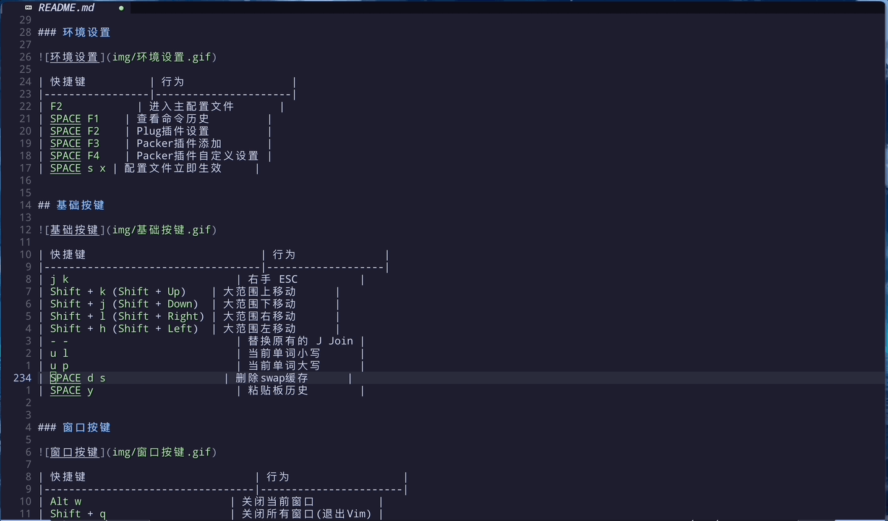


### 窗口按键

| 快捷键                           | 行为                  |
|----------------------------------|-----------------------|
| `Alt` `w`                        | 关闭当前窗口          |
| `Shift` + `q`                    | 关闭所有窗口(退出Vim) |
| (`Ctrl` + `v`) (`Ctrl` + `v`)    | 垂直分屏              |
| (`Ctrl` + `s`) (`Ctrl` + `s`)    | 水平分屏              |
| (`Ctrl` + `s`) (`Ctrl` + `v`)    | 水平切换到垂直        |
| (`Ctrl` + `v`) (`Ctrl` + `s`)    | 垂直切换到水平        |
| `Alt` `k`/`j`/`l`/`h`            | 切换窗口              |
| `Alt` `Up`/`Down`/`Left`/`Right` | 改变窗口大小          |


### 标签按键

| 快捷键             | 行为                                         |
|--------------------|----------------------------------------------|
| `t` `1`/`2`.../`9` | 切换到标签1 (1-9)                            |
| `Alt` + `]`        | 切换到下一个标签                             |
| `Alt` + `[`        | 切换到上一个标签                             |
| `Tab`              | 切换到下一个buffer(buffer就是已打开的编辑区) |
| `Shift` + `Tab`    | 切换到上一个buffer                           |
| `Space` `Tab`      | 删除当前buffer                               |

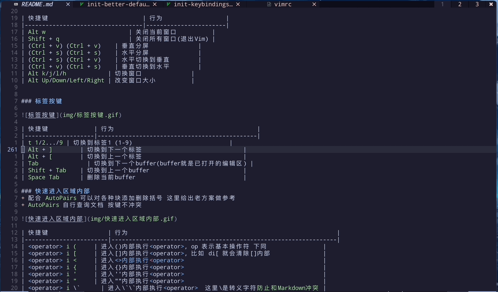

### 快速进入区域内部
+ 配合 `AutoPairs` 可以对各种块添加删除括号 这里给出老方案做参考
+ `AutoPairs` 自行查询文档 按键不冲突

| 快捷键                 | 行为                                                            |
|------------------------|-----------------------------------------------------------------|
| <operator> `i` `(`     | 进入()内部执行<operator>, op 表示基本操作符 下同                |
| <operator> `i` `[`     | 进入[]内部执行<operator>, 比如 di[ 就会清除[]内部               |
| <operator> `i` `<`     | 进入<>内部执行<operator>                                        |
| <operator> `i` `{`     | 进入{}内部执行<operator>                                        |
| <operator> `i` `'`     | 进入''内部执行<operator>                                        |
| <operator> `i` `"`     | 进入""内部执行<operator>                                        |
| <operator> `i` \`      | 进入\`\`内部执行<operator>  这里\是转义字符`防止和Markdown冲突` |
| <visual> `Shift` + `s` | 使用 AutoPairs 对<visual>块添加某种括号                         |

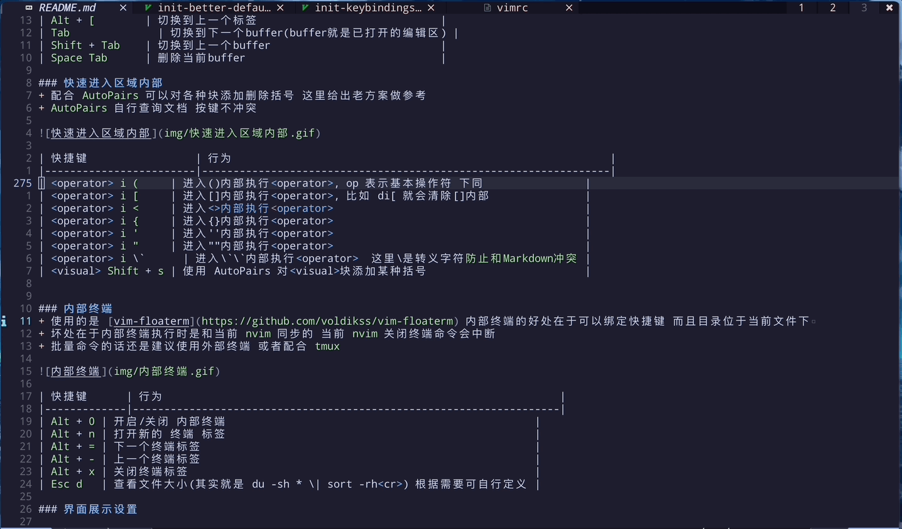


### 内部终端
+ 使用的是 [vim-floaterm](https://github.com/voldikss/vim-floaterm) 内部终端的好处在于可以绑定快捷键 而且目录位于当前文件下
+ 坏处在于内部终端执行时是和当前 `nvim` 同步的 当前 `nvim` 关闭终端命令会中断
+ 批量命令的话还是建议使用外部终端 或者配合 `tmux`

| 快捷键      | 行为                                                               |
|-------------|--------------------------------------------------------------------|
| `Alt` + `0` | 开启/关闭 内部终端                                                 |
| `Alt` + `n` | 打开新的 终端 标签                                                 |
| `Alt` + `=` | 下一个终端标签                                                     |
| `Alt` + `-` | 上一个终端标签                                                     |
| `Alt` + `x` | 关闭终端标签                                                       |
| `Esc` `d`   | 查看文件大小(其实就是 du -sh * \| sort -rh<cr>) 根据需要可自行定义 |

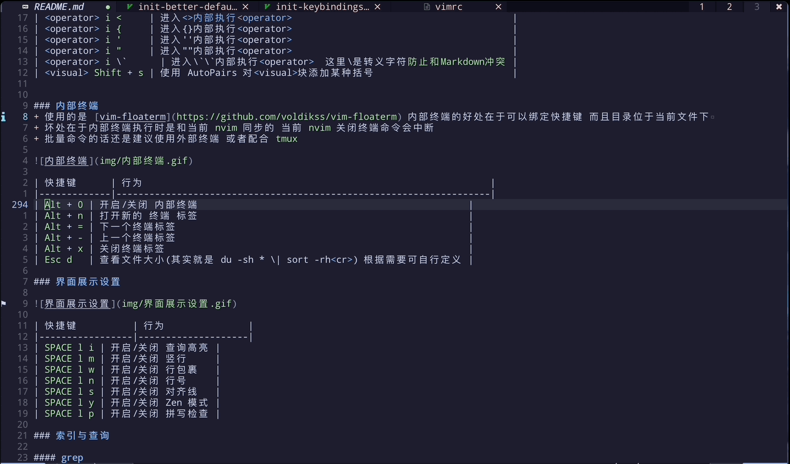

### 界面展示设置

| 快捷键          | 行为               |
|-----------------|--------------------|
| `SPACE` `l` `i` | 开启/关闭 查询高亮 |
| `SPACE` `l` `m` | 开启/关闭 竖行     |
| `SPACE` `l` `w` | 开启/关闭 行包裹   |
| `SPACE` `l` `n` | 开启/关闭 行号     |
| `SPACE` `l` `s` | 开启/关闭 对齐线   |
| `SPACE` `l` `y` | 开启/关闭 Zen 模式 |
| `SPACE` `l` `p` | 开启/关闭 拼写检查 |

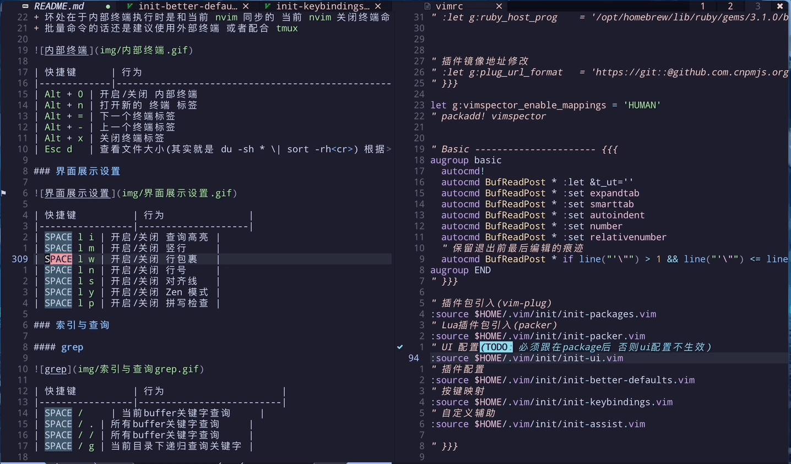

### 索引与查询

#### grep

| 快捷键          | 行为                     |
|-----------------|--------------------------|
| `SPACE` `/`     | 当前buffer关键字查询     |
| `SPACE` `/` `.` | 所有buffer关键字查询     |
| `SPACE` `/` `/` | 所有buffer关键字查询     |
| `SPACE` `/` `g` | 当前目录下递归查询关键字 |

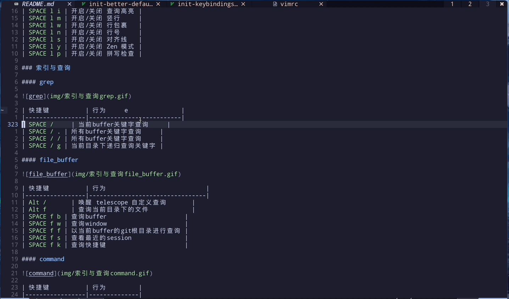

#### file_buffer

| 快捷键          | 行为                                |
|-----------------|-------------------------------------|
| `Alt` `/`       | 唤醒 telescope 自定义查询           |
| `Alt` `f`       | 唤醒 fzf 查询当前目录下的文件       |
| `SPACE` `f` `b` | 查询 buffer                         |
| `SPACE` `f` `w` | 查询 window                         |
| `SPACE` `f` `f` | 以当前 buffer 的 git 根目录进行查询 |
| `SPACE` `f` `s` | 查看最近的 session                  |
| `SPACE` `f` `k` | 查询快捷键                          |

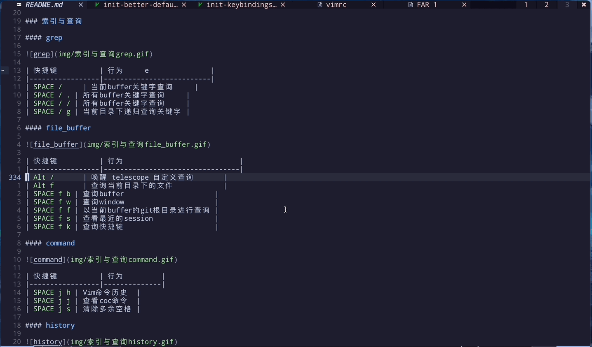

#### command

| 快捷键          | 行为         |
|-----------------|--------------|
| `SPACE` `j` `h` | Vim命令历史  |
| `SPACE` `j` `j` | 查看coc命令  |
| `SPACE` `j` `s` | 清除多余空格 |

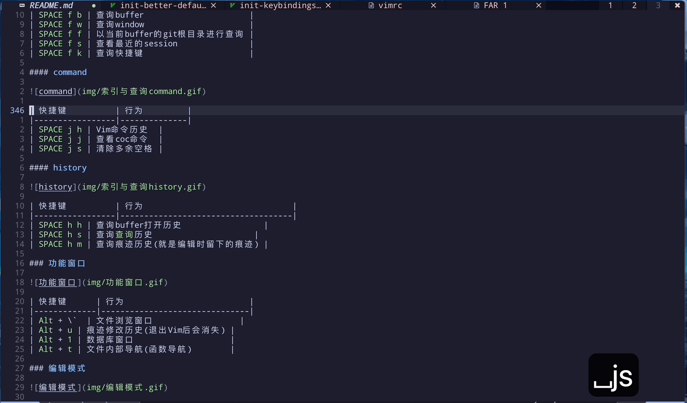

#### history

| 快捷键          | 行为                               |
|-----------------|------------------------------------|
| `SPACE` `h` `h` | 查询buffer打开历史                 |
| `SPACE` `h` `s` | 查询`查询`历史                     |
| `SPACE` `h` `m` | 查询痕迹历史(就是编辑时留下的痕迹) |

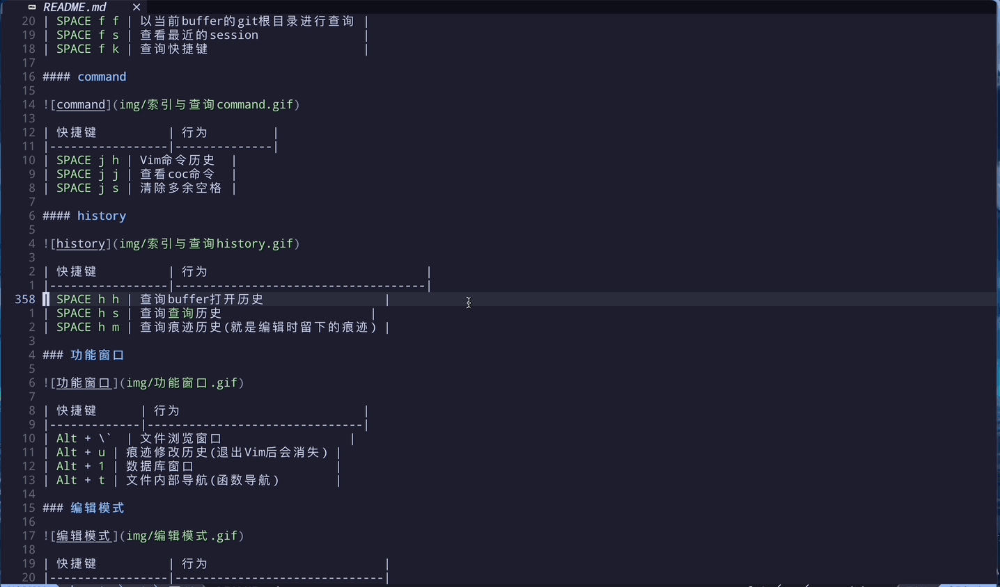

### 功能窗口

| 快捷键      | 行为                          |
|-------------|-------------------------------|
| `Alt` + \`  | 文件浏览窗口                  |
| `Alt` + `u` | 痕迹修改历史(退出Vim后会消失) |
| `Alt` + `1` | 数据库窗口                    |
| `Alt` + `t` | 文件内部导航(函数导航)        |

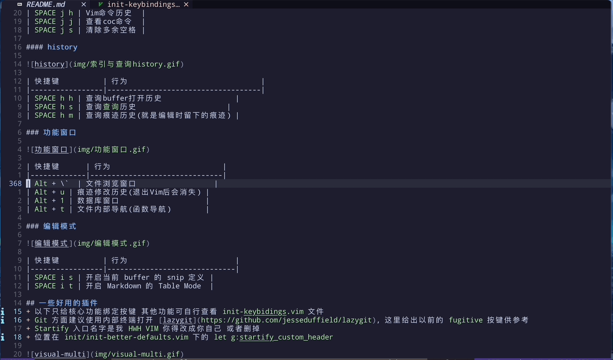

### 编辑模式

| 快捷键          | 行为                         |
|-----------------|------------------------------|
| `SPACE` `i` `s` | 开启当前 buffer 的 snip 定义 |
| `SPACE` `i` `t` | 开启 Markdown 的 Table Mode  |

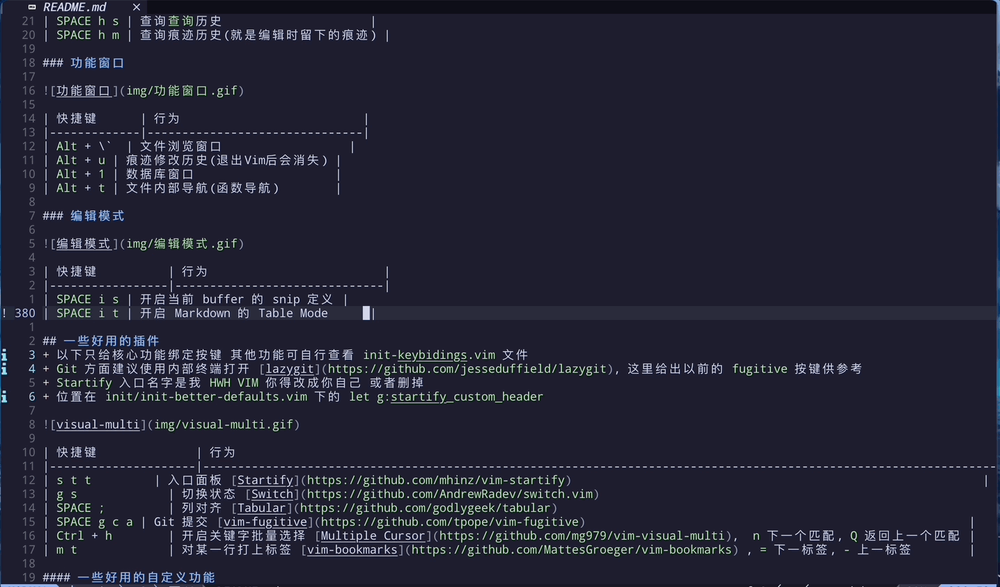

### 一些好用的插件
+ 除了之前给出的 `Telescope` 和 `coc.nvim` 外, 还有很多好用的`第三方插件`
+ 之前可能已经给出了一些快捷键这里再提一下
+ 这里给出常用的 很多优秀的插件我也没用过 `以你为准`

| 快捷键              | 行为                                                                                                                 |
|---------------------|----------------------------------------------------------------------------------------------------------------------|
| `s` `t` `t`         | 入口面板 [Startify](https://github.com/mhinz/vim-startify)                                                           |
| `g` `s`             | 切换状态 [Switch](https://github.com/AndrewRadev/switch.vim)                                                         |
| `SPACE` `;`         | 列对齐 [Tabular](https://github.com/godlygeek/tabular)                                                               |
| `SPACE` `g` `c` `a` | Git 提交 [vim-fugitive](https://github.com/tpope/vim-fugitive)                                                       |
| `Ctrl` + `h`        | 开启关键字批量选择 [Multiple Cursor](https://github.com/mg979/vim-visual-multi),  `n` 下一个匹配, `Q` 返回上一个匹配 |
| `m` `t`             | 对某一行打上标签 [vim-bookmarks](https://github.com/MattesGroeger/vim-bookmarks) , `=` 下一标签, `-` 上一标签        |
| `SPACE` `SPACE` `f` | 快速定位 [vim-easymotion](https://github.com/easymotion/vim-easymotion)                                              |

+ `FZF` 快速查询
    + 属于 `Neovim` 标配了 必须要有的
    + `Telescope` 底层就是用它

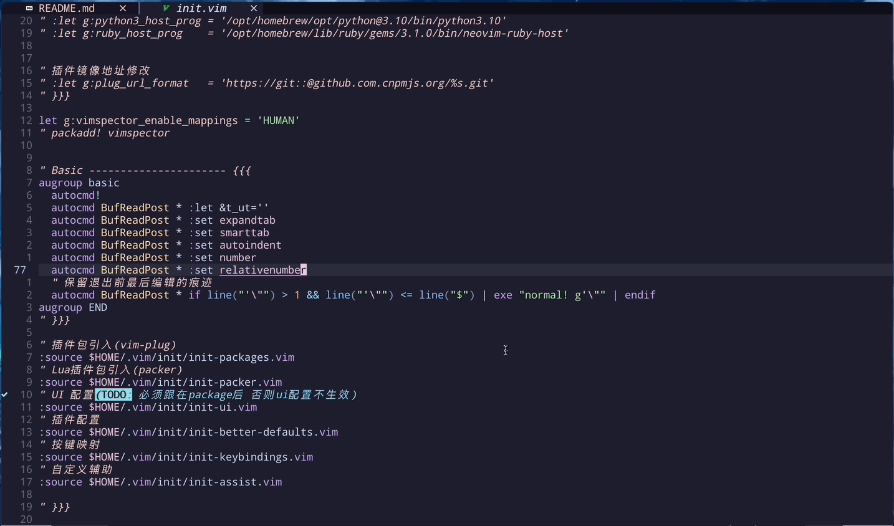

+ `switch` 状态切换插件


+ `tabular` 列对齐插件

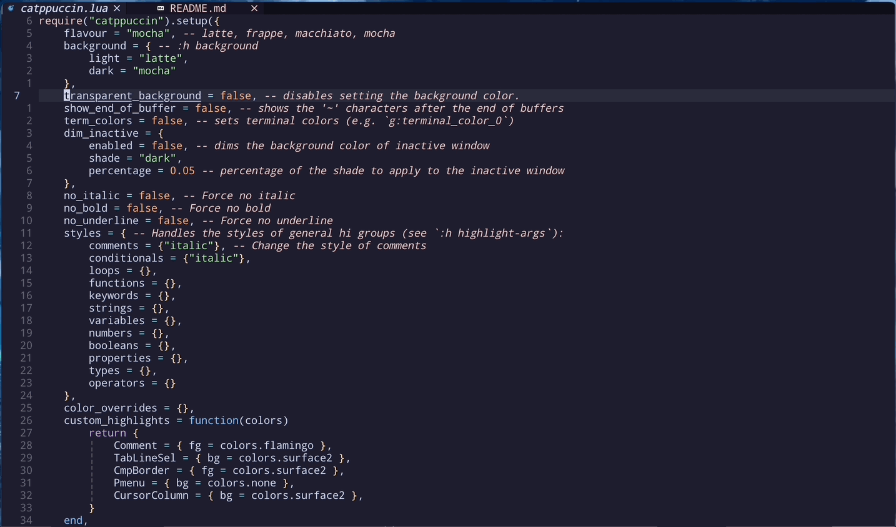

+ `visual-multi` 多位选择插件

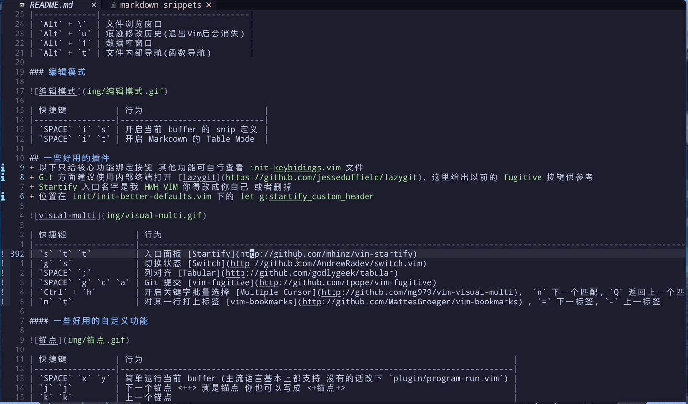

+ `vim-bookmarks` 标记插件

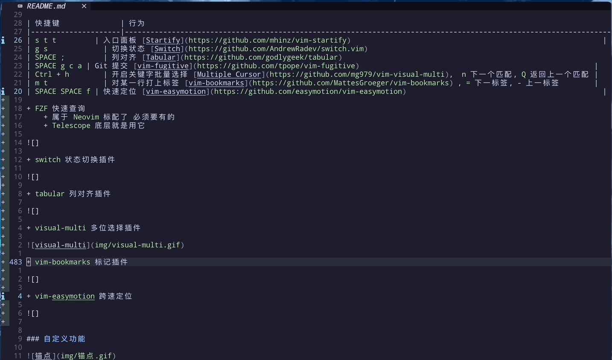

+ `vim-easymotion` 快速定位

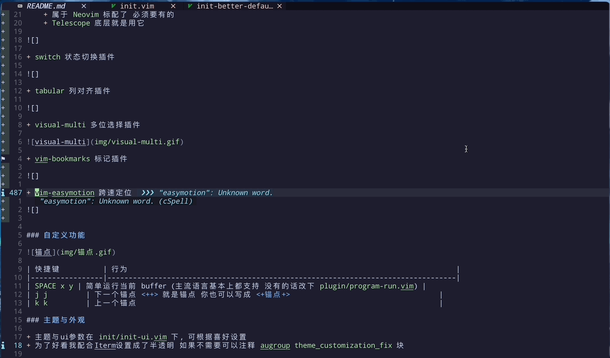


### 自定义功能

| 快捷键          | 行为                                                                             |
|-----------------|----------------------------------------------------------------------------------|
| `SPACE` `x` `y` | 简单运行当前 buffer (主流语言基本上都支持 没有的话改下 `plugin/program-run.vim`) |
| `j` `j`         | 下一个锚点 <++> 就是锚点 你也可以写成 <+锚点+>                                   |
| `k` `k`         | 上一个锚点                                                                       |

+ 锚点定位

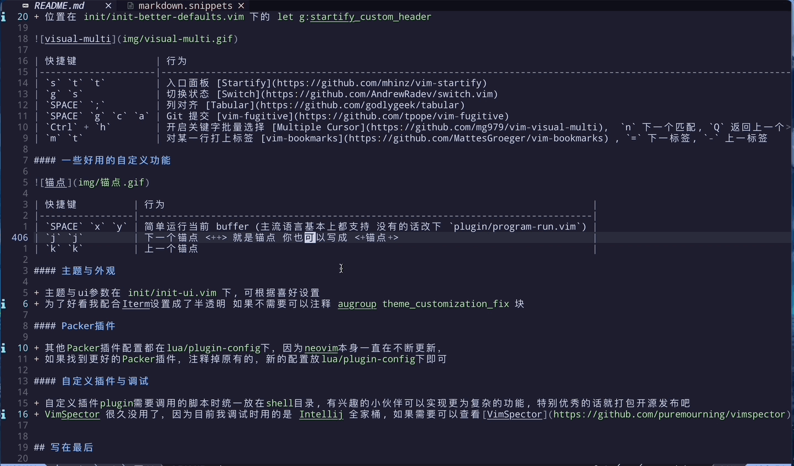

### 主题与外观

+ 主题与ui参数在 `init/init-ui.vim` 下, 可根据喜好设置
+ 为了好看我配合Iterm设置成了半透明 如果不需要可以注释 `augroup theme_customization_fix` 块

### Packer插件

+ 其他`Packer`插件配置都在`lua/plugin-config`下，因为`neovim`本身一直在不断更新，
+ 如果找到更好的`Packer`插件，注释掉原有的，新的配置放`lua/plugin-config`下即可

### 自定义插件与调试

+ 自定义插件`plugin`需要调用的脚本时统一放在`shell`目录, 有兴趣的小伙伴可以实现更为复杂的功能, 特别优秀的话就打包开源发布吧
+ `VimSpector` 很久没用了，因为目前我调试时用的是 `Intellij` 全家桶, 如果需要可以查看[VimSpector](https://github.com/puremourning/vimspector)，快捷键保证不和 `F2` `F3` 冲突即可

<p align="right">(<a href="#readme-top">返回顶部</a>)</p>


<!-- 路线图 -->

## 路线图
- [x] 基础功能与目录结构
- [x] 基本信息与设计目的
- [x] 安装方式与环境组件
- [x] 给出用法与按键表
- [x] 第三方插件补充与完善
- [x] 徽章与Logo完善


<p align="right">(<a href="#readme-top">返回顶部</a>)</p>


<!-- 贡献 -->

## 贡献

贡献是使开源社区成为一个如此令人惊叹的地方，以学习、激励和创造。您所做的任何贡献都将非常感谢。

如果您对使这个项目变得更好有建议，请 fork 该仓库并创建 pull request。您也可以打开一个带有“enhancement”标签的问题。不要忘记给这个项目点个星！再次感谢！

<p align="right">(<a href="#readme-top">返回顶部</a>)</p>


<!-- 许可证 -->
## 许可证

根据 MIT 许可证进行分发。更多信息请参见 [LICENSE.txt](LICENSE.txt)。

<p align="right">(<a href="#readme-top">返回顶部</a>)</p>


<!-- 联系方式 -->
## 联系方式

博客地址: [http://mkdocs.grft.top](http://mkdocs.grft.top)

项目链接: [https://github.com/worst001/nvim_0](https://github.com/worst001/nvim_0)

如果有帮到你就到博客请我喝杯咖啡吧，我真的很爱喝！


<p align="right">(<a href="#readme-top">返回顶部</a>)</p>


<!-- 鸣谢 -->
## 鸣谢

暂时就写这么点，`Vim` 大佬有很多，有兴趣的可以看这个配置, 我也是跟这个神仙学的: [theniceboy](https://github.com/theniceboy/nvim)。 `Neovim` 发展的很快，2022年年底左右 `lua plugin` 已经有人实现了自动化安装，不知不觉也已经有了 `go client` 了。随着社区的壮大，功能也在不断迭代，随着使用和学习的深入有更多的功能用法等你去发现!

[https://github.com/theniceboy/nvim](https://github.com/theniceboy/nvim)

[https://github.com/neovim/neovim](https://github.com/folke/lazy.nvim)

[https://github.com/folke/lazy.nvim](https://github.com/folke/lazy.nvim)

[https://github.com/rockerBOO/awesome-neovim](https://github.com/rockerBOO/awesome-neovim)

[https://openai.com/chatgpt](https://openai.com/chatgpt)

[https://github.com/CompVis/stable-diffusion](https://github.com/CompVis/stable-diffusion)

[https://github.com/AUTOMATIC1111/stable-diffusion-webui](https://github.com/AUTOMATIC1111/stable-diffusion-webui)

<p align="right">(<a href="#readme-top">返回顶部</a>)</p>


<!-- MARKDOWN LINKS & IMAGES -->
<!-- https://www.markdownguide.org/basic-syntax/#reference-style-links -->
<!-- links -->
[your-project-path]: shaojintian/Best_README_template
[contributors-shield]: https://img.shields.io/github/contributors/worst001/nvim_0.svg?style=flat-square
[contributors-url]: https://github.com/worst001/nvim_0/graphs/contributors
[forks-shield]: https://img.shields.io/github/forks/worst001/nvim_0.svg?style=flat-square
[forks-url]: https://github.com/worst001/nvim_0/network/members
[stars-shield]: https://img.shields.io/github/stars/worst001/nvim_0.svg?style=flat-square
[stars-url]: https://github.com/worst001/nvim_0/stargazers
[issues-shield]: https://img.shields.io/github/issues/worst001/nvim_0.svg?style=flat-square
[issues-url]: https://img.shields.io/github/issues/worst001/nvim_0.svg
[license-shield]: https://img.shields.io/github/license/worst001/nvim_0.svg?style=flat-square
[license-url]: https://github.com/worst001/nvim_0/blob/main/LICENSE.txt
[Startify-pic]: Startify.png

[Neovim-pic]: https://img.shields.io/badge/editor-neovim-green.svg
[ruby-pic]: https://img.shields.io/badge/Language-Ruby-red.svg
[node-pic]: https://img.shields.io/badge/Runtime-Node.js-green.svg
[python-pic]: https://img.shields.io/badge/Language-Python-blue.svg
[clang-pic]: https://img.shields.io/badge/Language-C%2B%2B-blue.svg
[golang-pic]: https://img.shields.io/badge/Language-Go-lightblue.svg
[java-pic]: https://img.shields.io/badge/Language-Java-orange.svg
[lua-pic]: https://img.shields.io/badge/Language-Lua-blue.svg
[fzf-pic]: https://img.shields.io/badge/Tool-fzf-green.svg
[ag-pic]: https://img.shields.io/badge/Tool-The_Silver_Searcher-blue.svg
[rg-pic]: https://img.shields.io/badge/Tool-ripgrep-green.svg
[Font-pic]: https://img.shields.io/badge/Font-DroidSansMono%20Nerd%20Font-blue

[Neovim-url]: https://neovim.io
[ruby-url]: https://www.ruby-lang.org
[node-url]: https://nodejs.org
[python-url]: https://www.python.org
[clang-url]: https://clang.llvm.org
[golang-url]: https://golang.org
[java-url]: https://www.oracle.com/java
[lua-url]: https://www.lua.org
[fzf-url]: https://github.com/junegunn/fzf
[ag-url]: https://github.com/ggreer/the_silver_searcher
[rg-url]: https://github.com/BurntSushi/ripgrep
[Font-url]: https://www.nerdfonts.com/font-downloads
