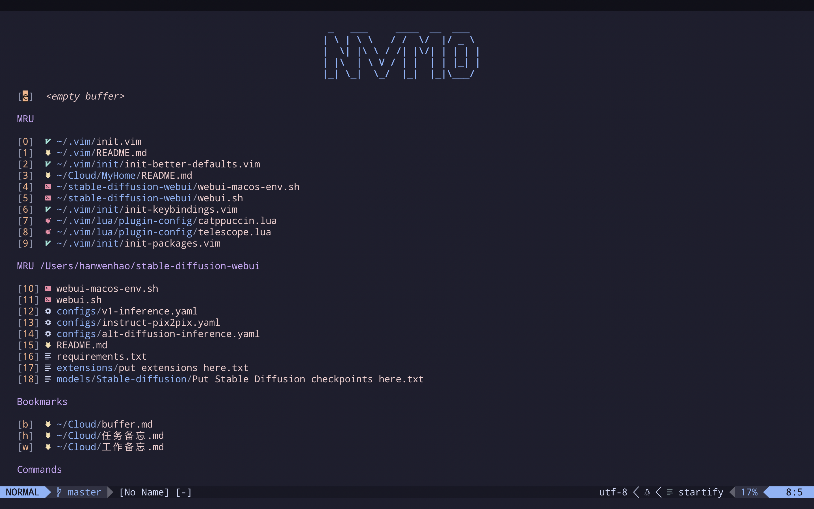

<!-- PROJECT SHIELDS -->

[![Contributors][contributors-shield]][contributors-url]
[![Forks][forks-shield]][forks-url]
[![Stargazers][stars-shield]][stars-url]
[![Issues][issues-shield]][issues-url]
[![MIT License][license-shield]][license-url]
<!-- [![LinkedIn][linkedin-shield]][linkedin-url] -->

<!-- PROJECT LOGO -->

# 完整的 nvim 配置

<!-- TOC -->
* [基本信息](#基本信息)
  - [初始化的时候分了5个模块在init，分别为](#初始化的时候分了5个模块在init，分别为)
  - [插件包分为Plug包、自定义包、Lua包](#插件包分为Plug包、自定义包、Lua包)
  - [基本配置与按键](#基本配置与按键)
  - [如何安装](#如何安装)
  - [需要注意的](#需要注意的)
* [目录结构](#目录结构)
  - [环境设置](#环境设置)
* [基础按键](#基础按键)
  - [窗口按键](#窗口按键)
  - [标签按键](#标签按键)
  - [快速进入区域内部](#快速进入区域内部)
  - [内部终端](#内部终端)
  - [界面展示设置](#界面展示设置)
  - [索引与查询](#索引与查询)
    + [grep](#grep)
    + [file&buffer](#file&buffer)
    + [command](#command)
    + [history](#history)
  - [功能窗口](#功能窗口)
  - [编辑模式](#编辑模式)
* [一些好用的插件](#一些好用的插件)
  - [一些好用的自定义功能](#一些好用的自定义功能)
  - [主题与外观](#主题与外观)
  - [Packer插件](#Packer插件)
  - [自定义插件与调试](#自定义插件与调试)
* [写在最后](#写在最后)
 <!-- /TOC -->

## 基本信息

主要使用 [coc.nvim](https://github.com/neoclide/coc.nvim) 实现代码补全，配置了 `NeoVim` 所需要基本功能，为了层次清晰定义了一些结构。

插件涵盖所有主流编辑功能，部署完后只要环境允许可以开发各类语言，供学习用当然开发也是没有问题的

`这个是几年前的配置方案，仅供参考`，现在有很多新的插件，`Neovim` 不断的在迭代，不可能停滞不前。


#### 初始化的时候分了5个模块在init，分别为
+ `init-packages.vim`: Plug插件包配置
+ `init-ui.vim`: 界面与主题相关配置
+ `init-packer.vim`: Lua插件包配置
+ `init-better-defaults.vim`: 自定义基础配置
+ `init-keybindings.vim`: 按键绑定配置
+ `init-assist.vim`: 辅助功能配置

#### 插件包分为Plug包、自定义包、Lua包
+ plug包在`init-packages.vim`设置后默认生成在`plugged`目录
+ lua插件包相关配置解耦在`lua/plugin-config`
+ 自定义插件可以写在`plugin`目录
+ `shell`目录为自定义脚本，然后让自定义插件去调就可以了

#### 基本配置与按键
> 暂时没时间写详细文档，这里简要先说一下

+ 基本配置`init-better-defaults.vim`里主要配置Plug插件所必需的选项
    + 如果该插件有一些按键配置没有解耦的很好也会放这里，不过不多
    + indent配置都在这里，如果有需要你也可以使用插件中的
+ 按键配置都放在 `init-keybindings.vim` 不需要就注释掉
    + 主要还是个人习惯 不爽就改成你的

#### 如何安装

+ `Neovim` 默认环境路径是用户目录下的 `.vim`
+ `Neovim` 默认使用 `init.vim` 替换原来的 `vimrc`
+ 因为习惯了 `vim` 的 `vimrc` 这里新建了 `vimrc` 文件然后做了软链接

1. 先安装 [Neovim](https://github.com/neovim/neovim/releases)
+ 安装完后以 `Linux`/`Mac` 为例其配置目录默认为 `~/.config/nvim`

2. 设置配置目录 安装插件管理
+ 创建软链接 这里为了和原生 `Vim` 统一对路径做了些处理
+ 根据自身环境情况可可自行定义路径

```bash
# home
cd ~

# clone
git clone git@github.com:worst001/nvim_0.git .vim

# nvim 配置链接为 .vim
ln -sf  ~/.vim ~/.config/nvim

# vimrc 软链为 init.vim
ln -sf  ~/.vim/vimrc ~/.vim/init.vim

# 先要安装 vim plug
sh -c 'curl -fLo "${XDG_DATA_HOME:-$HOME/.local/share}"/nvim/site/autoload/plug.vim --create-dirs \
       https://raw.githubusercontent.com/junegunn/vim-plug/master/plug.vim'

# 还需要安装 packer
git clone --depth 1 https://github.com/wbthomason/packer.nvim ~/.local/share/nvim/site/pack/packer/start/packer.nvim

```

3. 进入`Neovim`, 检查环境并安装插件
```vim
# 第一次进入因为没有插间会报错不用管

# 检查环境 保证各类语言的客户端能够对接到 Neovim
:checkhealth

# 安装 Plug 插件
:PlugInstall

# 安装 Packer 插件
:PackerSync

```

4. 显示 `Startify 界面` 表示安装成功



+ `Startify` 页面用的是自己的名字 `HWH VIM`
+ 可以使用 [figlet](https://github.com/cmatsuoka/figlet) 自行修改主界面名称(注意转义字符)


#### 需要注意的
用的neovim在7.0以上，功能还是相对比较全的。所以在安装前先运行 `:checkhealth` 确保python、nodejs、ruby这些环境都在。
理论上大部分程序环境你都需要装，比如

+ ruby: 提供内置终端界面
+ node: coc补全插件根本离不开它
+ python: 一些插件比如ranger会用到, 还有强大的ultisnips
+ clang: 不管是mac还是linux这个必备
+ golang: 底层插件FZF就是用go写的，你说要不要
+ java: 这个也不可能没有吧
+ lua: packer插件必备
+ 此外你的终端环境需要有
    + [fzf](https://github.com/junegunn/fzf)、
    + [ag](https://github.com/ggreer/the_silver_searcher)、
    + [rg](https://github.com/BurntSushi/ripgrep)
    + 等插件，最好配上 [tmux](https://github.com/tmux/tmux)
+ 因为年代有点久了，心血来潮就这么发上来了，有一些命令可能没有
+ 没有的话你就要慢慢调试了[`摊手`]

## 目录结构
```
.vim
├── README.md
├── autoload
│   ├── dbext.vim.bak
│   ├── dbext_dbi.vim.bak
│   ├── plug.vim
│   └── plug.vim.old
├── coc-settings.json
├── init
│   ├── config
│   │   └── db.vim
│   ├── init-assist.vim
│   ├── init-better-defaults.vim
│   ├── init-keybindings.vim
│   ├── init-packages.vim
│   ├── init-packer.vim
│   ├── init-ui.vim
│   └── new
├── init.vim -> /Users/hanwenhao/.vim/vimrc
├── lua
│   ├── plugin-config
│   │   ├── bufferline.lua
│   │   ├── nvim-tree.lua
│   │   ├── persisted.lua
│   │   ├── telescope.lua
│   │   └── todo-comments.lua
│   └── plugins.lua
├── pack
│   └── vimspector
│       └── opt
├── package-lock.json
├── plugged
├── plugin
│   ├── terminal-open.vim
│   ├── text-highlight.vim
│   └── vimcdoc.vim
├── sessions
│   └── default.vim
├── shell
│   ├── prettier
│   ├── scalafix
│   ├── time
│   ├── uncrustify
│   ├── xml-prettier
│   └── xml2js
├── syntax
│   └── help_cn.vim
├── tree.txt
└── vimrc

```
#### 环境设置
| 快捷键    | 行为                |
|-----------|---------------------|
| `F2`        | 进入主配置文件      |
| `SPACE` `F1`  | 查看命令历史        |
| `SPACE` `F2`  | Plug插件设置        |
| `SPACE` `F3`  | Packer(Lua)插件设置 |
| `SPACE` `s` `x` | 配置文件立即生效    |

## 基础按键
| 快捷键                    | 行为              |
|---------------------------|-------------------|
| `j` `k`                       | 右手 ESC          |
| `Shift` + `k` (`Shift` + `Up`)    | 大范围上移动      |
| `Shift` + `j` (`Shift` + `Down`)  | 大范围下移动      |
| `Shift` + `l` (`Shift` + `Right`) | 大范围右移动      |
| `Shift` + `h` (`Shift` + `Left`)  | 大范围左移动      |
| `-` `-`                       | 替换原有的 J Join |
| `u` `l`                       | 当前单词小写      |
| `u` `p`                       | 当前单词大写      |
| `SPACE` `d` `s`                 | 删除swap缓存      |
| `SPACE` `y`                   | 粘贴板历史        |

#### 窗口按键
| 快捷键                 | 行为                  |
|------------------------|-----------------------|
| `Alt` `w`                  | 关闭当前窗口          |
| `Shift` + `q`              | 关闭所有窗口(退出Vim) |
| (`Ctrl` + `v`) (`Ctrl` + `v`)  | 垂直分屏              |
| (`Ctrl` + `s`) (`Ctrl` + `s`)  | 水平分屏              |
| (`Ctrl` + `s`) (`Ctrl` + `v`)  | 水平切换到垂直        |
| (`Ctrl` + `v`) (`Ctrl` + `s`)  | 垂直切换到水平        |
| `Alt` `k`/`j`/`l`/`h`            | 切换窗口              |
| `Alt` `Up`/`Down`/`Left`/`Right` | 改变窗口大小          |

#### 标签按键
| 快捷键      | 行为                                         |
|-------------|----------------------------------------------|
| `t` `1`/`2`.../`9`  | 切换到标签1 (1-9)                            |
| `Alt` + `]`     | 切换到下一个标签                             |
| `Alt` + `[`     | 切换到上一个标签                             |
| `Tab`         | 切换到下一个buffer(buffer就是已打开的编辑区) |
| `Shift` + `Tab` | 切换到上一个buffer                           |
| `Space` `Tab`   | 删除当前buffer                               |

#### 快速进入区域内部
+ 配合 `AutoPairs` 可以对各种块添加删除括号 这里给出老方案做参考
+ `AutoPairs` 自行查询文档 按键不冲突

| 快捷键             | 行为                                                            |
|--------------------|-----------------------------------------------------------------|
| <operator> `i` `(`     | 进入()内部执行<operator>, op 表示基本操作符 下同                |
| <operator> `i` `[`     | 进入[]内部执行<operator>, 比如 di[ 就会清除[]内部               |
| <operator> `i` `<`     | 进入<>内部执行<operator>                                        |
| <operator> `i` `{`     | 进入{}内部执行<operator>                                        |
| <operator> `i` `'`     | 进入''内部执行<operator>                                        |
| <operator> `i` `"`     | 进入""内部执行<operator>                                        |
| <operator> `i` \`    | 进入\`\`内部执行<operator>  这里\是转义字符`防止和Markdown冲突` |
| <visual> `Shift` + `s` | 使用 AutoPairs 对<visual>块添加某种括号                         |


#### 内部终端
+ 使用的是 `Floaterm` 内部终端的好处在于可以绑定快捷键 而且目录位于当前文件下 
+ 坏处在于内部终端执行时是和当前 `nvim` 同步的 当前 `nvim` 关闭终端命令会中断
+ 批量命令的话还是建议使用外部终端 或者配合 `tmux`

| 快捷键  | 行为                                            |
|---------|-------------------------------------------------|
| `Alt` + `0` | 开启/关闭 内部终端                              |
| `Alt` + `n` | 打开新的 终端 标签                              |
| `Alt` + `=` | 下一个终端标签                                  |
| `Alt` + `-` | 上一个终端标签                                  |
| `Alt` + `x` | 关闭终端标签                                    |
| `Esc` `d` | 查看文件大小(其实就是 du -sh * \| sort -rh<cr>) 根据需要可自行定义 |

#### 界面展示设置
| 快捷键    | 行为               |
|-----------|--------------------|
| `SPACE` `l` `i` | 开启/关闭 查询高亮 |
| `SPACE` `l` `m` | 开启/关闭 竖行     |
| `SPACE` `l` `w` | 开启/关闭 行包裹   |
| `SPACE` `l` `n` | 开启/关闭 行号     |
| `SPACE` `l` `s` | 开启/关闭 对齐线   |
| `SPACE` `l` `y` | 开启/关闭 Zen 模式 |
| `SPACE` `l` `p` | 开启/关闭 拼写检查 |

#### 索引与查询

##### grep
| 快捷键    | 行为                     |
|-----------|--------------------------|
| `SPACE` `/`   | 当前buffer关键字查询     |
| `SPACE` `/` `.` | 所有buffer关键字查询     |
| `SPACE` `/` `/` | 所有buffer关键字查询     |
| `SPACE` `/` `g` | 当前目录下递归查询关键字 |

##### file&buffer
| 快捷键    | 行为                            |
|-----------|---------------------------------|
| `Alt` `/`     | 唤醒 telescope 自定义查询       |
| `Alt` `f`     | 查询当前目录下的文件            |
| `SPACE` `f` `b` | 查询buffer                      |
| `SPACE` `f` `w` | 查询window                      |
| `SPACE` `f` `f` | 以当前buffer的git根目录进行查询 |
| `SPACE` `f` `s` | 查看最近的session |
| `SPACE` `f` `k` | 查询快捷键  |

##### command
| 快捷键    | 行为        |
|-----------|-------------|
| `SPACE` `j` `h` | Vim命令历史 |
| `SPACE` `j` `j` | 查看coc命令 |
| `SPACE` `j` `s` | 清除多余空格|

##### history
| 快捷键    | 行为                                |
|-----------|-------------------------------------|
| `SPACE` `h` `h` | 查询buffer打开历史                  |
| `SPACE` `h` `s` | 查询`查询`历史                      |
| `SPACE` `h` `m` | 查询痕迹历史(就是编辑时留下的痕迹) |

#### 功能窗口
| 快捷键   | 行为                          |
|----------|-------------------------------|
| `Alt` + \` | 文件浏览窗口                  |
| `Alt` + `u`  | 痕迹修改历史(退出Vim后会消失) |
| `Alt` + `1`  | 数据库窗口                    |
| `Alt` + `t`  | 文件内部导航(函数导航)        |

#### 编辑模式
| 快捷键    | 行为                         |
|-----------|------------------------------|
| `SPACE` `i` `s` | 开启当前 buffer 的 snip 定义 |
| `SPACE` `i` `t` | 开启 Markdown 的 Table Mode  |

## 一些好用的插件
+ 以下只给核心功能绑定按键 其他功能可自行查看 `init-keybidings.vim` 文件
+ `Git` 方面建议使用内部终端打开 `lazygit`, 这里给出以前的 `fugitive` 按键供参考
+ `Startify` 入口名字是我 `hanwenhao` 你得改成你自己 或者删掉
+ 位置在 `init/init-better-defaults.vim` 下的 `let g:startify_custom_header`

| 快捷键      | 行为                                                                             |
|-------------|----------------------------------------------------------------------------------|
| `s` `t` `t`       | 入口面板 Startify                                                                |
| `g` `s`         | 切换状态 Switch                                                                  |
| `SPACE` `;`     | 列对齐 Tabular                                                                   |
| `SPACE` `g` `c` `a` | Git 提交 vim-fugitive                                                            |
| `Ctrl` + `h`    | 开启关键字批量选择 Multiple Cursor,  `n` 下一个匹配, `Q` 返回上一个匹配              |
| `m` `t`         | 对某一行打上标签 vim-bookmarks , `=` 下一标签, `-` 上一标签                          |

#### 一些好用的自定义功能
| 快捷键    | 行为                                                                             |
|-----------|----------------------------------------------------------------------------------|
| `SPACE` `x` `y` | 简单运行当前 buffer (主流语言基本上都支持 没有的话改下 `plugin/program-run.vim`) |
| `j` `j`       | 下一个锚点 <++> 就是锚点 你也可以写成 <+锚点+>                                   |
| `k` `k`       | 上一个锚点                                                                       |

#### 主题与外观

+ 主题与ui参数在 `init/init-ui.vim` 下, 可根据喜好设置
+ 为了好看我配合Iterm设置成了半透明 如果不需要可以注释 `augroup theme_customization_fix` 块

#### Packer插件

+ 其他`Packer`插件配置都在`lua/plugin-config`下，因为`neovim`本身一直在不断更新，
+ 如果找到更好的`Packer`插件，注释掉原有的，新的配置放`lua/plugin-config`下即可

#### 自定义插件与调试

+ 自定义插件`plugin`需要调用的脚本时统一放在`shell`目录, 有兴趣的小伙伴可以实现更为复杂的功能, 特别优秀的话就打包开源发布吧
+ `VimSpector` 很久没用了，因为目前我调试时用的是 `Intellij` 全家桶, 如果需要可以看官方文档，快捷键保证不和 `F2` `F3` 冲突即可


## 写在最后

暂时就写这么点，`Vim` 大佬有很多，有兴趣的可以看这个配置, 我也是跟这个神仙学的

[https://github.com/theniceboy/nvim](https://github.com/theniceboy/nvim)

`Neovim` 发展的很快，2022年年底左右 `lua plugin` 已经有人实现了自动化安装，不知不觉已经有 `go cliet` 了

随着使用和学习的深入有更多的功能用法等你去发现、去实现


#### 参考资料
[https://github.com/theniceboy/nvim](https://github.com/theniceboy/nvim)

[https://github.com/neovim/neovim](https://github.com/folke/lazy.nvim)

[https://github.com/folke/lazy.nvim](https://github.com/folke/lazy.nvim)

[https://github.com/rockerBOO/awesome-neovim](https://github.com/rockerBOO/awesome-neovim)

#### 博客地址

喜欢学习技术的小伙伴可以访问我的博客，主页地址请访问这里

- 访问入口：[http://mkdocs.grft.top](http://mkdocs.grft.top)

<!-- links -->
[your-project-path]:shaojintian/Best_README_template
[contributors-shield]: https://img.shields.io/github/contributors/worst001/nvim_0.svg?style=flat-square
[contributors-url]: https://github.com/worst001/nvim_0/graphs/contributors
[forks-shield]: https://img.shields.io/github/forks/worst001/nvim_0.svg?style=flat-square
[forks-url]: https://github.com/worst001/nvim_0/network/members
[stars-shield]: https://img.shields.io/github/stars/worst001/nvim_0.svg?style=flat-square
[stars-url]: https://github.com/worst001/nvim_0/stargazers
[issues-shield]: https://img.shields.io/github/issues/worst001/nvim_0.svg?style=flat-square
[issues-url]: https://img.shields.io/github/issues/worst001/nvim_0.svg
[license-shield]: https://img.shields.io/github/license/worst001/nvim_0.svg?style=flat-square
[license-url]: https://github.com/worst001/nvim_0/blob/main/LICENSE.txt
